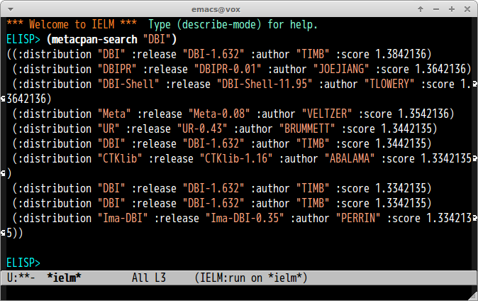

# metacpan.el

## Introduction

Use [metacpan](https://metacpan.org/) API from Emacs.


## Screenshot




## Basic Usage

#### `(metacpan-search query)`

Search `query`.


## Example

```lisp
(metacpan-search "Furl")
```
